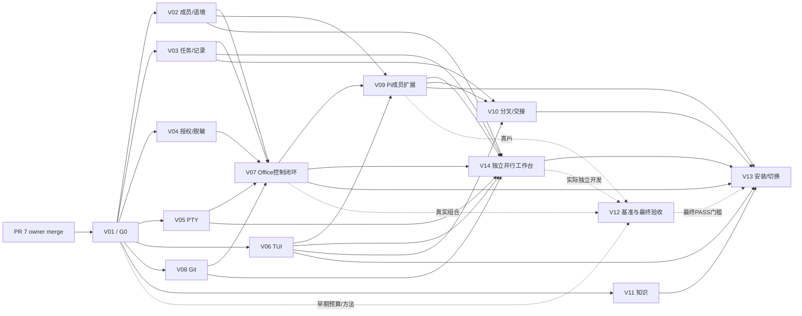

# Viva Rust Office 实施与并行 issue 计划

Status: **Planning / not implemented** · 2026-09-28 · Owner: Haisu

本文安排已批准技术方案的交付工作，不授权任何 Agent 自批、自合并，也不代表运行能力已建成。范围/验收细节以对应 GitHub issue 为执行单，本文持有共享接口门槛、文件归属、依赖与集成规则。

## 1. 决策与代码基线

- 用户已批准 Rust + Tokio + Ratatui/Crossterm、Pi 交互终端 + 小型扩展、SQLite + 普通文件；Python 代码没有延续/兼容义务，资产与有效产品/授权契约仍须成立。
- [技术裁决 PR #7](https://github.com/zuohaisu/viva/pull/7) 已合并；权威目标为 [ADR 0011](../decisions/0011-rust-host-and-tui.md)。
- 原规划基线 `c52794ac2638b9236db0ac20db3ac594ca8dfae9` 只有 Python + Textual。2026-09-28 复核主线 `f5824de54acba9eeb925c69f39dc579d7811ef13`：Rust 基础 [PR #31](https://github.com/zuohaisu/viva/pull/31) 已合并、[#10](https://github.com/zuohaisu/viva/issues/10) 已关闭，Rust/Python CI 通过；[主并行开发 PR #32](https://github.com/zuohaisu/viva/pull/32) 仍开放，尚未交付独立可用的工作台。现有 Python 能力与测试仍是参考契约，不是 Rust 代码移植清单。
- 当前 runner 的 stdin 为 DEVNULL，stdout/stderr 写日志，不能承载交互 Pi；当前界面会话状态只有指针，没有本轮目标的持久谈话树。
- 实施序列为 **14 个首版 issue + 4 个后续 issue + 1 个统筹 Epic**。单条 issue 交付一个可演示、可独立验证的能力单元，含实现与必要测试；不按函数/文件拆小票，也不把整个 Rust 重写装进一个票。
- 已合并的 PR #7 研究已定位 Hermes Holographic 的公开实现；用户实际使用 bundled/handoff/community 哪个版本仍需核对，只有其接入 issue 等待这项输入。其余开发使用现有 Office 资料/brief，明确没有外部记忆时不声称记得。

### 1.1 首个可用版本的使用入口（2026-09-28 修订）

用户要求 **至少替代 Orca 多 worktree 并行开发**：从普通 Terminal/iTerm 启动一次 Viva，在这间 Office 内管理多个项目、任务、Agent/测试/shell 终端；不是每任务再开一个 Viva，也不把 Orca 当必需宿主。[产品验收门槛](../product/first-usable-version.md)为权威要求；[Orca 源码复用核查](../research/orca-reuse-audit-2026-09-28.md)说明可用代码与耦合，未建立集成。

新增 V14 工作台组合体验，发布需真3任务隔离并行、真Pi+另一CLI、多终端交互/改动检查、独立复核/PR证据、停止隔离与退出恢复。自动 workflow/Holographic/电脑操作仍可后做；正常手工并行开发不可后置。Orca 提供 MIT 源码和无Electron orcad入口，V05 先验证 execution slice/helper 与成熟RustPTY路线再选；helper若采用必须由Viva拥有并随TUI退出回收，不能原样沿用detach生存语义。

## 2. 共享语义与 G0 门槛（V01 持有）

| 契约 | 固定语义 |
| --- | --- |
| 成员/角色/模型/工具 | 不混成一个 Agent 对象；名字与绑定为配置；换 harness 不删除长期资产 |
| 普通对话 / Task Execution | 普通对话可没有 Task；会话引用/标题/树是 Office 元数据，不是新的聊天引擎；Task Execution 固定 Task 与完整归属 |
| 启动规格 | 显式 argv/cwd、成员/工具/模型/工作位置、请求来源/授权、资源预算；不接受拼接 shell 作为通用入口 |
| 终端接口 | 最小 spawn/input/resize/snapshot/stop/wait；终端状态与进程事件分开；宿主拥有 live handle |
| 控制请求/结果 | request ID、版本、大小限制、可信 caller 绑定/授权、幂等与错误；客户端自报 user/worker 或 grant ID 不是身份凭据 |
| 任务结果 | 进程退出 ≠ Task完成 ≠ QA结论 ≠ PR/CI/默认分支交付；结果含 Task/Execution/来源/证据 |
| 存储 | SQLite 管事实关系与追加审计；文件管正文/原始材料；一事实一权威来源，数据库不原子化外部进程与文件效果 |
| grant | 现有 task/actions/mode 范围不可放大；普通聊天不会自动得到全办公室权限；新任务创建需明确用户动作/授权记录 |
| 工作台/辅助终端 | 同一 Office 跨项目导航；Task/worktree 多终端，用户 shell owner 与成员 Execution 分清；列表/需处理标记是事实投影，不造第二套 workflow |

G0 完成条件：可运行 Rust binary + 一条真实 SQLite 事件重载/回滚 + 可编译接口 + 对上述语义的接口测试 + 迁移域/文件 owner 表。定义接口不等于完成域实现；G0 后其他模块即可针对固定接口并行，不等所有基础功能一次做完。

旧文档中 Execution 的 completed 用于零退出码、以及“没有 Chat 对象”的措辞，需要 V01 按以上已批准语义校准：保留进程结果与 Office 会话元数据，避免引入竞争状态。未经明确批准不改变 core ontology。

## 3. 14 个首版交付单元

| Code / issue | 可验收交付 | 建议 lane | 合入依赖 |
| --- | --- | --- | --- |
| [V01 / #10](https://github.com/zuohaisu/viva/issues/10) | Rust 可运行基础、SQLite 事务底座与并行接口门槛 | A：基础/集成 | 技术裁决 PR #7 |
| [V02 / #11](https://github.com/zuohaisu/viva/issues/11) | 成员、模型工具绑定与多项目工作语境 | B：成员/语境 | [V01 / #10](https://github.com/zuohaisu/viva/issues/10) |
| [V03 / #12](https://github.com/zuohaisu/viva/issues/12) | 任务、执行记录与可恢复的交接历史 | C：任务/状态 | [V01 / #10](https://github.com/zuohaisu/viva/issues/10) |
| [V04 / #13](https://github.com/zuohaisu/viva/issues/13) | 委派授权、调用来源与流式脱敏 | D：授权/安全 | [V01 / #10](https://github.com/zuohaisu/viva/issues/10) |
| [V05 / #14](https://github.com/zuohaisu/viva/issues/14) | 交互 PTY、终端状态与进程树生命周期 | E：终端运行时 | [V01 / #10](https://github.com/zuohaisu/viva/issues/10) |
| [V06 / #15](https://github.com/zuohaisu/viva/issues/15) | 办公室 TUI 与内嵌终端的键盘交互 | F：界面 | [V01 / #10](https://github.com/zuohaisu/viva/issues/10) |
| [V07 / #16](https://github.com/zuohaisu/viva/issues/16) | 活跃 Office 控制面、CLI 回调与退出恢复闭环 | A：基础/集成 | V02, V03, V04, V05, V08 |
| [V08 / #17](https://github.com/zuohaisu/viva/issues/17) | Git/worktree 隔离与 GitHub 证据关联 | G：Git 集成 | [V01 / #10](https://github.com/zuohaisu/viva/issues/10) |
| [V09 / #18](https://github.com/zuohaisu/viva/issues/18) | Pi 默认对话宿主与成员办公室扩展 | B：成员/Pi | V02, V04, V07, V06 |
| [V10 / #19](https://github.com/zuohaisu/viva/issues/19) | 会话分叉、重命名与跨 harness 交接 | C：任务/会话 | V03, V09, V06 |
| [V11 / #20](https://github.com/zuohaisu/viva/issues/20) | 知识与技能的来源、取用和退出机制 | G：知识 | [V01 / #10](https://github.com/zuohaisu/viva/issues/10) |
| [V12 / #21](https://github.com/zuohaisu/viva/issues/21) | 资源、响应与故障恢复的基准和最终验收 | H：验收 | [V01 / #10](https://github.com/zuohaisu/viva/issues/10) |
| [V13 / #22](https://github.com/zuohaisu/viva/issues/22) | Rust 安装发行与 Python 入口退役 | A：交付/集成 | V06, V07, V09, V10, V11, V14 |
| [V14 / #27](https://github.com/zuohaisu/viva/issues/27) | 独立替代 Orca 的多 worktree 并行开发工作台 | F：工作台组合 | V02, V03, V05, V06, V07, V08, V09 |

## 4. 并行安排与依赖

| 阶段 | 可并行工作 | 合入/验收门槛 |
| --- | --- | --- |
| 基础 | V01；其他 owner 阅读/接口评审；V12 准备采样场景 | 技术裁决合并 + G0，只有一个基础/root 编辑者 |
| 主并行窗口 | V02、V03、V04、V05、V06、V08、V11；V12 准备基准 | 同一 G0 接口；UI 可用快照测试，领域可独立真实 SQLite/临时 Git验证，不能叫完整产品 PASS |
| Office 组合 | V07 组合 V02/V03/V04/V05/V08；V06 接真实状态/PTY；V09 扩展可按固定协议并行 | CLI → 活跃 Office → 真实进程闭环；缺依赖仍可开发但不可声明集成通过 |
| 体验/知识 | V09 真 Pi；V14 独立并行工作台；V10 树/交接；V11 知识集成；V12 真负载与恢复验收 | G1 基线/预算到位；真实界面/工具/数据证据，模拟不冒充实测 |
| 发行 | V13 集成、数据保全/入口切换/退役 Python；V12 最终验收 | 实际平台/恢复/资源验收 + owner PR merge + 默认分支验证 |

推荐 5–7 条可切换的开发 lane，按机器资源决定实际活跃数；lane 是建议职责，不是假装已派发 Agent/GitHub assignee。A 先做 V01 再 V07/V13；B 做 V02 后 V09；C 做 V03 后 V10；D 做 V04；E 做 V05；F 做 V06 后 V14；G 可先 V08 再 V11，资源充足时分两个 owner；H 为独立验收/QA。16 Agent 是产品运行峰值，不能拿它当并行编译数量。

V06 的独立合入证明 shell/键盘/终端快照行为；真实 Office/Pi 组合验收在 V07/V09，不把模拟快照称为完整体验。V11 先交付独立知识域，usage/brief 与界面注册通过 V07/V09/V13 验证。

箭头是合入/最终验收依赖，不代表下游完全不能先写自己的目录。V12 的 G1（方法/预算/首切片基线）与最终 PASS 分开，不能把整个验收票完成作为早期开发前提。性能采样独占窗口，与其他构建/测试错开；每个 worker 用独立 worktree、VIVA_HOME、数据库和临时 repo。

## 5. 文件归属与变更协调

Rust 源码已由 V01 置于 `crates/viva/`；其余领域按目录分开，Pi extension 计划独立在 `extensions/pi/`。各 issue 正文列写路径，默认不动别人的目录。

- V01 初建 Cargo/root/module registry/CI。G0 后共享 `Cargo.toml`、`Cargo.lock`、lib/main、composition 与公共 envelope 由 V07/A 协调；发行阶段交给 V13。依赖新增用小变更请求排队，不能多人同时无协调重写锁文件。
- 各领域拥有自己的 schema migration namespace（members/workspaces/projects、tasks/executions、authority、git、conversations、knowledge）；SQLite engine/全局版本/迁移注册为 V01→V07 owner。迁移版本规则在 G0 测试不同合入顺序，避免预编号导致后合入迁移漏跑。
- V14 owns `tui/workbench/` 与独立组合场景；依赖模块仍归原 owner，路由注册由 V06/A 协调。工作台从事实查询动作接口组合，不维护竞争 Task/Worktree 工作流状态。
- V06 owns TUI shell，后续 conversations/knowledge 面板在各自子目录；注册/路由由 shell owner 协调。V09 owns Pi 扩展入口，V10/F04 子模块仅通过明确入口注册，避免多个 Agent 改一份总扩展。
- 实施不要求永久 Python 桥接。V13 统一入口与旧代码退役；此前 CI 暂时并存验证是交付过程，不是产品双运行时承诺。
- 每票一个 worktree/feature branch/Ready PR。基于已合入依赖的最新 origin/main；缺依赖可独立写/测，不为跑通而 cherry-pick 他人未合入工作后假称主线成立。共享接口变更先协调、更新契约与受影响票，已执行中的 issue 不随意改范围。
- Developer/QA 不自批自合并；human owner 执行 merge 或精确授权 Controller。该计划不授权任何实际 merge、删除/prune、付费调用或操作用户桌面。

## 6. 后续能力与故事覆盖

| Code / issue | 可验收交付 | 建议 lane | 合入依赖 |
| --- | --- | --- | --- |
| [F01 / #23](https://github.com/zuohaisu/viva/issues/23) | 交付类 Task 的可复用工作流与授权交付 | A：工作流 | V03, V04, V07, V08, V09 |
| [F02 / #24](https://github.com/zuohaisu/viva/issues/24) | 运行期间的知识复审与仓库维护建议 | G：维护 | V04, V07, V08, V11 |
| [F03 / #25](https://github.com/zuohaisu/viva/issues/25) | 复用现成工具完成浏览器与原生应用操作 | E：工具集成 | V04, V07, V09 |
| [F04 / #26](https://github.com/zuohaisu/viva/issues/26) | 核对并接入现用 Holographic 外部记忆 | B：记忆接入 | V04, V09, V11 |

| 用户故事 | 首版覆盖 / 明确后续 |
| --- | --- |
| 1 以协调成员为入口 | V02/V06/V09；名字、greeting/安静方式是配置，不假装已具备长期记忆 |
| 2 多路径多项目/reference | V02/V08 |
| 3 对话分叉与重命名 | V10（复用 Pi 原生树，非所有 harness 强制同能力） |
| 4 记忆与退出 | V11 的来源/取用/退出 + F04 真实外部记忆；自动复审 F02，不自动演化 Self |
| 5 工具模型选择/派发 | V02/V07/V09；安全 fetch V08，dirty repo 不盲 pull |
| 6 worktree/Git | V08/V07/V14：独立管理、发现/选择已有 worktree、多终端与 diff |
| 7 PM/Dev/QA/PR/CI 与槽位 | V03/V04/V07/V08/V12/V14 支持首版人工并行开发/复核与真实PR证据；F01 再自动化可配置 delivery workflow；受保护动作仍需 owner |
| 8 经验与 skill | V11 + F02；搜索到的 skill 不自动安装或变为可信知识 |
| 9 项目维护 | F02；worktree 删除仍须人类命名授权 |
| 10 按风险选择沙箱 | V04/V05/V07，验证实际环境/凭证可用，授权不是 OS 沙箱 |
| 计算机操作扩展 | F03：先复用已存在工具，两个低风险真实任务验证，不提前建通用自动化平台 |

Holographic 适配应复用 PR #7 的[固定源码研究](https://github.com/zuohaisu/viva/blob/a5ad11cbd5d57dea89578b7426cf7579c8779ccb/docs/research/hermes-holographic-memory-2026-09-28.md)。已知缺口是受控跨 harness 接口、成员/项目隔离、来源审计与可恢复归档；不把标签当权限、删除当归档、FTS/HRR 当训练语义 embedding。

## 7. 诚实验收与退出条件

- 本计划/issue 创建只推进规划支撑，不代表 Rust/Pi/SQLite/记忆已运行。每票提交验证命令、真实运行记录及未跑项。
- 单元/模拟测证明接口逻辑；真实 PTY/Pi/gh/目标 Mac 证明集成与平台事实。缺模型凭证或 Intel 机器保留 pending，不改成 PASS。
- 发布前首先通过 V14 独立开发演示：Orca.app关闭且不调用其CLI，一次Viva启动，3真实任务/隔离worktree、Pi+另一CLI、多终端/diff/验证、停一个不影响邻居、退出保全代码并重开。16真实Agent峰值预算另由V12采样。
- 发布前要求真实的成员→Task→授权派发→隔离执行→独立结果/复核→停/重启/交接与知识使用证据；进入 F01 才增远端交付自动化。
- 桌面/Windows、共享数据库/云同步、自建 harness/记忆框架、退役 ticket subsystem 不纳入这批票。

## 8. GitHub 执行入口

统筹 [Epic #8](https://github.com/zuohaisu/viva/issues/8)；首版 V01–V14 与后续 F01–F04 均已建单（见上表）。issue 正文记录验收/范围/依赖，本文记录共享协调规则。原规划 [PR #9](https://github.com/zuohaisu/viva/pull/9) 已合并；本次追加 V14 #27 的独立替代门槛。原规划未派发 Agent，现有 PR #31/#32 的执行状态以 GitHub 为准。
